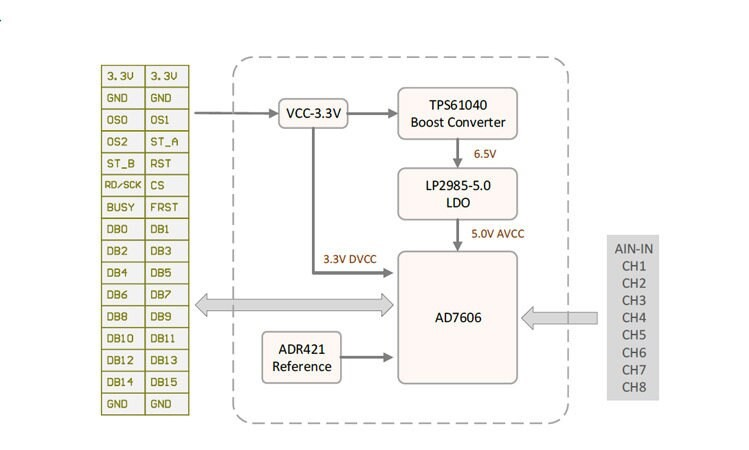
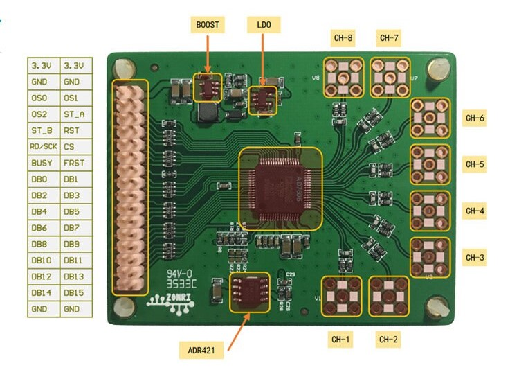
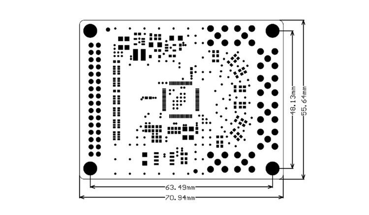

# Hardware Description

## AD7606 Module
### **1. Overview**

AD7606 Module block diagram

AD7606 Module hardware diagram

AD7606 Module mechanic

### **2. AD7606 Onboard Resistor Setting Description**
1. Use Internal reference: R28 is removed, R24 is removed and R19 is soldered with 1K resistor.
2. Use External reference: R28 soldered 0R resistor, R19 is removed, R24 is soldered with 1K resistor.
3. Parallel interface setting: R18 is removed, R23 is soldered with 1K resistor.
4. Serial interface setting: R18 is soldered with 1K resistor, R23 is removed.
5. 5V input range setting: R22 is soldered with 1K resistor, R17 is removed.
6. 10V input range setting: R17 is soldered with 1K resistor, R22 is removed.